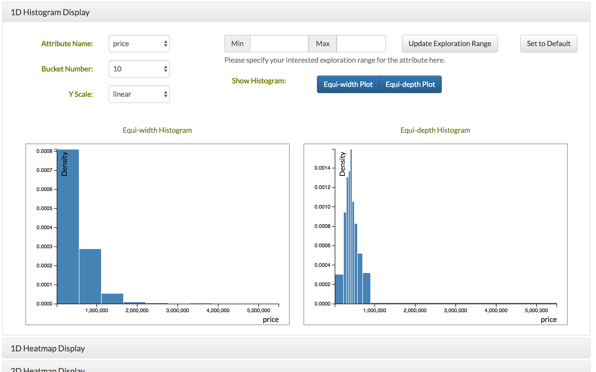
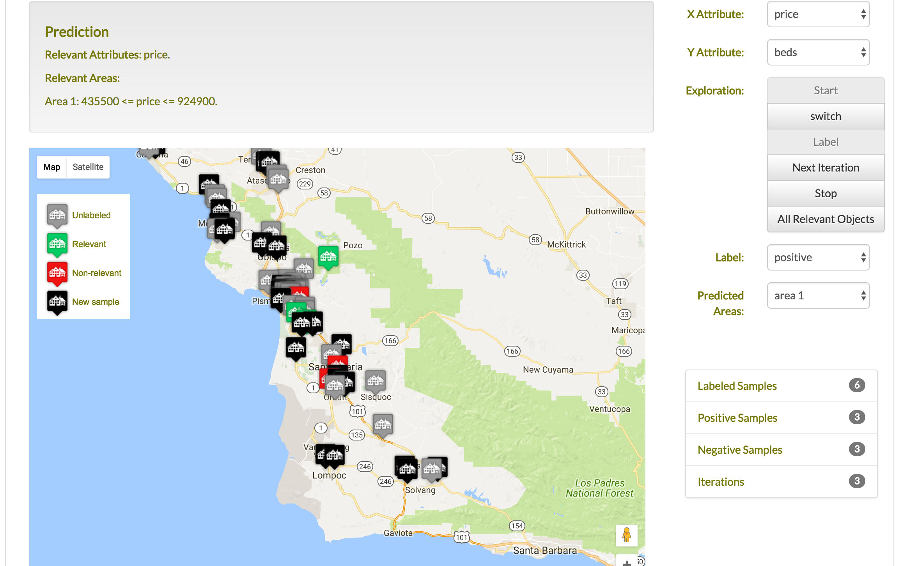
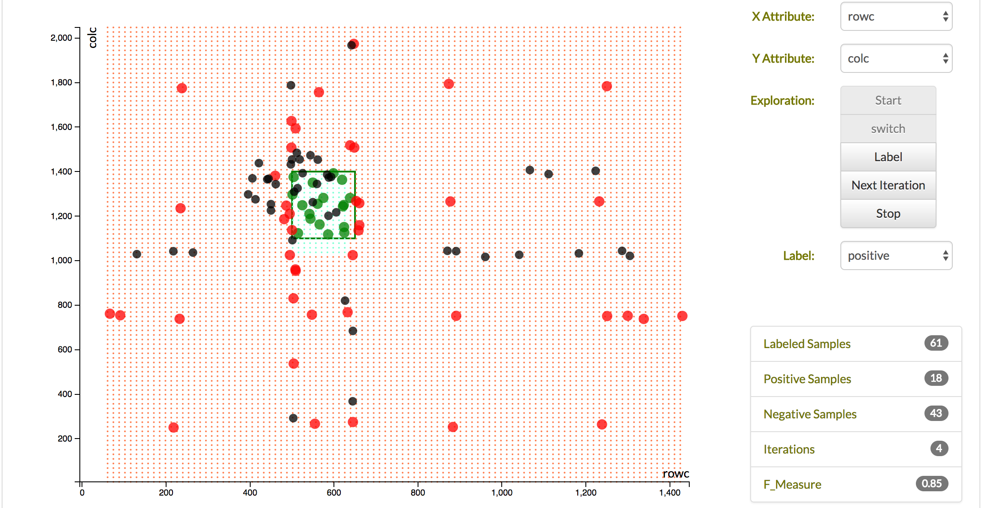
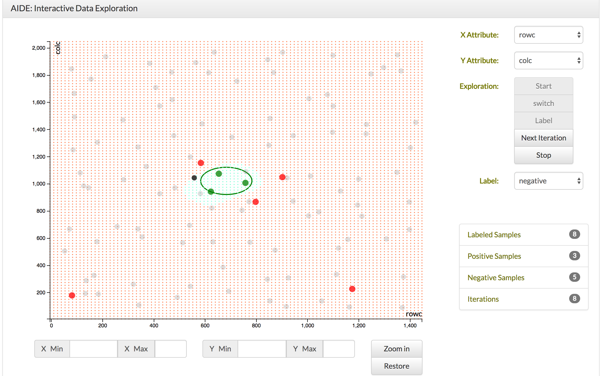

# README #

This is the interactive data exploration web application project. This application automates the process to help user find interesting data patterns. 
This is a web application. To use this code, you need to put the code in a server that can parse PHP files.
Then the users can start the application from the entry page, connect.php, in their browsers.

## data distribution display

## interactive labeling through maps

## decision tree based model prediction

## SVM based model prediction

